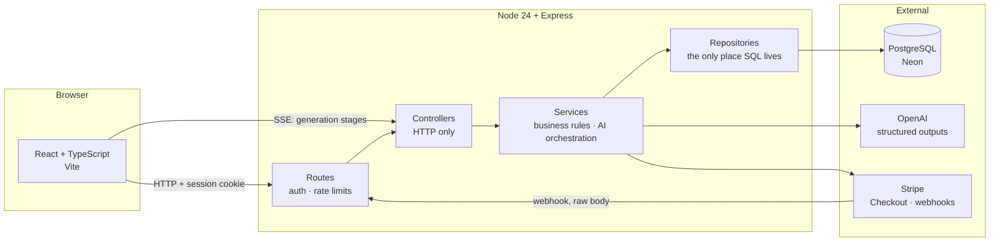

# Mosaic Kitchen AI

**AI meal planning for multicultural households in the UK.** Plans a week of
meals around a household's real cuisines, dietary restrictions, budget and
current pantry contents, then builds the shopping list from what is missing.

Most meal planners assume a mainstream Western diet. Mosaic Kitchen is built
around the opposite assumption: a Hunan household and a Cantonese household
should not receive the same week of food, and "Chinese" is not a cuisine
anybody actually cooks.

**Status: feature-complete web application, not yet deployed.** Everything
described below runs locally against a real database, a real Stripe account
in test mode, and a real OpenAI account. Nothing in this README describes a
feature that does not exist; the [known gaps](#known-gaps) are listed as
plainly as the features.

**Stack** — React + TypeScript (Vite) · Node 24 + Express + TypeScript with
native type stripping, no build step · PostgreSQL (Neon) via raw `pg` ·
OpenAI structured outputs · Stripe · Server-Sent Events

---

## Engineering highlights

| Area | What is built |
| --- | --- |
| **Session auth** | Hand-rolled, PostgreSQL-backed sessions. bcrypt cost 12, 256-bit session ids, `HttpOnly` cookies, timing-attack defence on unknown emails, per-route rate limiting |
| **Google OAuth** | `openid-client` v6 with PKCE, `state` and `nonce` per attempt. Identities keyed on `(provider, sub)`, never on email |
| **Stripe billing** | Hosted Checkout and Customer Portal. Webhooks verified against the raw body, made idempotent through a `stripe_events` table, and re-fetched from the API rather than trusted from the payload |
| **Structured AI output** | Zod-derived JSON schema enforced by the model API, with the cuisine enum built per request so an out-of-list cuisine is unrepresentable |
| **Deterministic validation** | Allergens, meal count, cost arithmetic and budget band checked in code after generation, with one targeted retry. A prompt is a request; this is the guarantee |
| **SSE streaming** | Five real generation stages streamed over `fetch` + `ReadableStream`. No invented progress percentage |
| **Bilingual content** | Plans generated in the reader's language; stored plans translated on demand and cached, with a 220-entry ingredient lexicon answering most strings before any model call |
| **Usage and cost metering** | Every call recorded in `ai_usage` including failures and retries, per-user monthly quotas, and a global spend ceiling that only ever refuses free accounts |
| **RAG-ready schema** | pgvector tables, HNSW index, scoped retrieval SQL and a grocery-availability catalogue (region + store class). **Schema only — the corpus is empty, nothing is indexed, and generation does not consult it.** See [`docs/rag.md`](docs/rag.md) |
| **Tests** | 209 backend, 13 frontend, plus a locale-coverage lint. Three tests read source to check that code and SQL agree |

---

## Architecture



Each layer knows only about the one below it. Controllers know about HTTP and
nothing about SQL; services know about business rules and throw tagged errors
(`error.code = 'QUOTA_EXCEEDED'`) for the controller to translate into a
status code; repositories know about SQL and nothing about business rules.

The practical payoff: services are testable without an HTTP server, and adding
a second client — an iOS app — requires no change below the controller.

→ [`docs/architecture.md`](docs/architecture.md) for the request path, the
storage rules and the testing strategy.

---

## Key engineering decisions

| Decision | Chosen | Rejected | Reasoning |
| --- | --- | --- | --- |
| Session model | Server-side sessions in PostgreSQL | JWT | A session can be revoked with a `DELETE`. A JWT is valid until it expires, so logout, password change and account deletion all become "please wait for the token to lapse" |
| Database access | Raw `pg` with hand-written SQL | ORM | Every query is visible and parameterised. The queries here are simple; what is not simple is the JSONB access and the compliance checks, which is exactly where an ORM helps least |
| Streaming transport | Server-Sent Events | WebSockets | Progress is one-directional and short-lived. A WebSocket adds a connection lifecycle, a heartbeat and a reconnect policy to solve a problem that does not exist |
| SSE client | `fetch` + `ReadableStream` | `EventSource` | `EventSource` cannot issue a POST and cannot send credentials cross-origin. Generation needs both |
| Plan storage | JSONB document | Relational meal/ingredient tables | A plan is produced once, always read whole, never queried into and never partially updated. Splitting it would mean three JOINs to rebuild something always wanted in one piece, and every prompt change would be a migration. Profiles get columns, because they are filtered and updated |
| AI output | Structured output + programmatic post-check | Prompt instructions alone | A schema constrains shape, not truth. Allergen exclusions are a safety property, so they are verified in code after the model has answered, and a violation triggers a retry that names the specific dish |
| Translation | Lookup table first, model for the rest | Model for everything | Ingredient names are over half the strings and repeat endlessly. Garlic is garlic — a lookup is cheaper *and* more consistent than a model |
| Grocery availability | Deterministic table lookup | Vector similarity | "Can this be bought in Sheffield?" is a fact with a yes/no answer. Nearest-neighbour returns the most similar thing, which is the wrong shape of answer for a shopping list. Retrieval is reserved for the questions that are genuinely about similarity: substitutions and regional cooking knowledge |
| Ingredient matching | Exact match only | Fuzzy or substring | Substring matching resolves 青椒炒肉丝 to "green pepper". A shopping list that sends someone home with the wrong vegetable is worse than one in the wrong language |

---

## What is implemented

**Accounts** — email/password signup and login, Google sign-in, session
management, account deletion and JSON data export (UK GDPR erasure and
access), password change for accounts that have one, and profile pictures
stored in Cloudflare R2. Uploads are decoded and re-encoded rather than
stored as received, which drops EXIF — a phone photo carries GPS coordinates,
and publishing those alongside a face is not a trade anyone agreed to.
→ [`docs/auth.md`](docs/auth.md)

**Billing** — three tiers, monthly and yearly, through Stripe Checkout and the
Customer Portal. Entitlements resolved from the live subscription; pricing-page
copy verified against them by a test.
→ [`docs/billing.md`](docs/billing.md)

**Household profile** — adults, teenagers, children and toddlers counted
separately because each changes the plan differently. Cuisine preferences can
be refined with regional or culinary **styles** — Hunan or Yunnan for Chinese
food, Kansai or home-style washoku for Japanese, Korean BBQ or Jeolla-style
cooking for Korean — because not every cuisine divides along a map. Plus
seasoning intensity, flavour preferences, nutrition emphasis, and free-text
ingredient exclusions. Styles are preference signals in the prompt, not
constraints; only the safety rules are enforced after generation.

**Pantry** — CRUD with quantities, units and expiry dates. Ownership enforced
in the SQL `WHERE` clause, so another user's row is structurally unreachable.
Bulk selection drives both bulk delete and cook-from-pantry.

**Meal plan generation** — from the real profile and pantry, streamed over SSE
with five genuine stages, validated deterministically, retried once on a
violation. Also a cheaper "cook from these ingredients" flow on its own quota.
→ [`docs/ai-generation.md`](docs/ai-generation.md)

**Shopping list** — aggregated from the plan minus what the pantry already
holds, with tick state, manual additions and undo on delete.

**Bilingual** — English and Simplified Chinese throughout, including generated
content. The interface language is a user setting sent on every request; stored
plans are translated on demand and cached.

---

## Known gaps

Written down deliberately. An honest list is more useful than a clean one.

- **Not deployed.** Production cookie behaviour (`Secure`, `SameSite=None`),
  CORS across two subdomains, and SSE through nginx have never been exercised
  outside localhost
- **No email verification, password reset or change-email.** All three need a
  provider sending from a verified domain. The forgot-password screen says so
  instead of pretending to send anything
- **Camera scanning does not exist.** The quota field and the pricing row are
  there; the feature is labelled "coming soon" and is not sold as available
- **RAG is scaffolding only.** The pgvector schema, the retrieval SQL and the
  grocery catalogue exist and are tested, but the corpus is empty, no embedding
  job has been run, and `RETRIEVAL_ENABLED` defaults to off. Generation behaves
  identically with it on or off. Variety currently comes from style rotation
  and a 40-dish do-not-repeat list
- **No mobile app and no grocery integrations.** Both are roadmap items
- **Expiry dates are user-entered.** A shelf-life lookup table exists but is
  not yet wired into the pantry write path
- **No account lockout.** Rate limiting is per-IP, so a distributed attack
  against one account is not slowed
- **Estimated costs are model guesses**, not supermarket prices. The arithmetic
  and the budget band are checked deterministically; the prices are not real
  quotes, and the interface does not claim otherwise

---

## Running it locally

Requires **Node 24+** (the backend runs TypeScript directly through native type
stripping, stable from 24.12), a [Neon](https://neon.com) PostgreSQL database,
and an OpenAI API key.

```bash
git clone https://github.com/cosmicoral/Mosaic-Kitchen-AI.git

cd Mosaic-Kitchen-AI/backend
npm install
cp .env.example .env          # fill in DATABASE_URL and OPENAI_API_KEY
npm run migrate:up
npm run dev

cd ../web
npm install
cp .env.example .env          # VITE_API_URL, defaults to http://localhost:3000
npm run dev
```

Google sign-in and Stripe are optional locally: without their environment
variables the app runs with email/password auth and everyone on the free tier.

### Tests

The backend suite truncates tables, so it runs against a **separate** Neon
branch — never the development one.

```bash
cd backend
cp .env.test.example .env.test   # DATABASE_URL must point at the test branch
npm run migrate:up:test
npm test
```

| Command | What it does |
| --- | --- |
| `npm run dev` | Start with file watching |
| `npm run typecheck` | Type-check without emitting |
| `npm test` | Full suite |
| `npm run migrate:create -- <name>` | Scaffold a `.sql` migration |
| `npm run generate:lexicon` | Regenerate the client's copy of the ingredient table |
| `npm run cleanup:sessions` | Delete expired sessions (intended as a daily cron) |

---

## Deployment

Not deployed yet. The plan and its running order are recorded in
[`docs/deployment.md`](docs/deployment.md).

```
Vercel (web)  ──HTTPS──▶  nginx on a VPS  ──▶  Node/Express  ──▶  Neon Postgres
  app.<domain>                api.<domain>
```

The API runs on a VPS rather than a serverless platform for three specific
reasons, each of which is also a production constraint that must be honoured:

| Constraint | Why it matters |
| --- | --- |
| **`proxy_buffering off` on the SSE routes** | nginx buffers responses by default, so the whole stream would arrive at once at the end. The symptom is a generation UI that appears frozen — not an error, just nothing |
| **HTTPS and cross-site cookies** | Cookies are `Secure` in production, so nothing authenticates over plain HTTP. `app.` and `api.` are different sites to a browser, so the session cookie needs `SameSite=None; Secure` or it is silently dropped and every request after login returns 401 |
| **Stripe webhook raw body** | Signature verification needs the unparsed body, on a route mounted before `express.json()`. A platform that parses the body first breaks verification for every event |

---

## Research background

Mosaic Kitchen is informed by doctoral research on healthy eating practices,
food waste, digital food platforms, ethnicity and food culture, and household
food routines.

The finding that shaped the product: people struggle with healthy and
sustainable eating not for lack of knowledge, but because of time pressure,
disrupted routines, cultural preferences and everyday practical constraints.
That is why the planner starts from what a household already owns and already
cooks, rather than from a nutritional ideal.

**PhD thesis** — *Everyday Practices, Identities and Materiality of Food
Consumption and Waste: A Case Study of Middle-Class Consumers in Kunming
(China)*, University of Surrey, 2026
· [Google Scholar](https://scholar.google.com/citations?user=Gp9ylswAAAAJ)

---

## Roadmap

- **Next** — deploy; self-service password reset; camera scanning, so the
  "coming soon" labels can come off
- **Then** — expiry-driven waste-reduction flow (discard / use fresh /
  preserve), shelf-life estimation wired into the pantry
- **Later** — populate the knowledge base: a UK grocery-availability catalogue
  first, so plans stop suggesting ingredients nobody can buy, then regional
  cooking documents; a SwiftUI client on the same API; retailer integration,
  which depends on a data source that does not currently exist publicly

---

Built in London.
