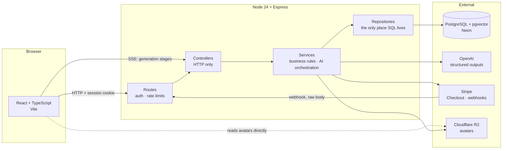

# Mosaic Kitchen AI

**AI meal planning for multicultural households in the UK.** Plans a week of
meals around a household's real cuisines, dietary restrictions, budget and
current pantry contents, then builds the shopping list from what is missing.

Most meal planners assume a mainstream Western diet. Mosaic Kitchen is built
around the opposite assumption: a Hunan household and a Cantonese household
should not receive the same week of food, and "Chinese" is not a cuisine
anybody actually cooks.

**Status: feature-complete web application, not yet deployed.** Everything
described below runs locally against a real database, a real Stripe account
in test mode, and a real OpenAI account. Nothing in this README describes a
feature that does not exist; the [known gaps](#known-gaps) are listed as
plainly as the features.

**Stack** — React + TypeScript (Vite) · Node 24 + Express + TypeScript with
native type stripping, no build step · PostgreSQL (Neon) via raw `pg`, with
pgvector · OpenAI structured outputs · Stripe · Cloudflare R2 ·
Server-Sent Events

---

## Engineering highlights

| Area | What is built |
| --- | --- |
| **Session auth** | Hand-rolled, PostgreSQL-backed sessions. bcrypt cost 12, 256-bit session ids, `HttpOnly` cookies, timing-attack defence on unknown emails, per-route rate limiting |
| **Google OAuth** | `openid-client` v6 with PKCE, `state` and `nonce` per attempt. Identities keyed on `(provider, sub)`, never on email |
| **Stripe billing** | Hosted Checkout and Customer Portal. Webhooks verified against the raw body, made idempotent through a `stripe_events` table, and re-fetched from the API rather than trusted from the payload |
| **Structured AI output** | Zod-derived JSON schema enforced by the model API, with the cuisine enum built per request so an out-of-list cuisine is unrepresentable |
| **Deterministic validation** | Allergens, meal count, cost arithmetic and budget band checked in code after generation, with one targeted retry. A prompt is a request; this is the guarantee |
| **SSE streaming** | Five real generation stages streamed over `fetch` + `ReadableStream`. No invented progress percentage |
| **Bilingual content** | Plans generated in the reader's language; stored plans translated on demand and cached, with a 220-entry ingredient lexicon answering most strings before any model call |
| **Usage and cost metering** | Every call recorded in `ai_usage` including failures and retries, per-user monthly quotas, and a global spend ceiling that only ever refuses free accounts |
| **Unit economics in code** | Stripe fees, VAT and the free-tier subsidy modelled alongside AI cost, with tests asserting each plan clears its net-profit target — including after VAT registration and at a poor conversion rate |
| **Knowledge layer (RAG-ready)** | pgvector tables with an HNSW index and scoped retrieval SQL, plus a deterministic grocery-availability catalogue. Built to stop plans suggesting ingredients that cannot be bought locally. **Schema only — the corpus is empty and generation does not consult it.** See [`docs/rag.md`](docs/rag.md) |
| **Media handling** | Avatar uploads decoded and re-encoded through sharp to 256px WebP, stored in Cloudflare R2. Re-encoding is what strips EXIF, and EXIF on a phone photo contains GPS coordinates |
| **i18n enforcement** | A lint over the source finds strings that would render in English while the app is in Chinese, in all four ways they can hide. It has caught 100+ gaps that page-by-page review missed |
| **Tests** | 267 backend, 18 frontend, plus the locale lint. Eight test files read source rather than exercising behaviour, to check that code, SQL, sales copy and the documentation all agree |

---

## Architecture



Each layer knows only about the one below it. Controllers know about HTTP and
nothing about SQL; services know about business rules and throw tagged errors
(`error.code = 'QUOTA_EXCEEDED'`) for the controller to translate into a
status code; repositories know about SQL and nothing about business rules.

The practical payoff: services are testable without an HTTP server, and adding
a second client — an iOS app — requires no change below the controller.

→ [`docs/architecture.md`](docs/architecture.md) for the request path, the
storage rules and the testing strategy.

---

## Key engineering decisions

| Decision | Chosen | Rejected | Reasoning |
| --- | --- | --- | --- |
| Session model | Server-side sessions in PostgreSQL | JWT | A session can be revoked with a `DELETE`. A JWT is valid until it expires, so logout, password change and account deletion all become "please wait for the token to lapse" |
| Database access | Raw `pg` with hand-written SQL | ORM | Every query is visible and parameterised. The queries here are simple; what is not simple is the JSONB access and the compliance checks, which is exactly where an ORM helps least |
| Streaming transport | Server-Sent Events | WebSockets | Progress is one-directional and short-lived. A WebSocket adds a connection lifecycle, a heartbeat and a reconnect policy to solve a problem that does not exist |
| SSE client | `fetch` + `ReadableStream` | `EventSource` | `EventSource` cannot issue a POST and cannot send credentials cross-origin. Generation needs both |
| Plan storage | JSONB document | Relational meal/ingredient tables | A plan is produced once, always read whole, never queried into and never partially updated. Splitting it would mean three JOINs to rebuild something always wanted in one piece, and every prompt change would be a migration. Profiles get columns, because they are filtered and updated |
| AI output | Structured output + programmatic post-check | Prompt instructions alone | A schema constrains shape, not truth. Allergen exclusions are a safety property, so they are verified in code after the model has answered, and a violation triggers a retry that names the specific dish |
| Translation | Lookup table first, model for the rest | Model for everything | Ingredient names are over half the strings and repeat endlessly. Garlic is garlic — a lookup is cheaper *and* more consistent than a model |
| Grocery availability | Deterministic table lookup | Vector similarity | "Can this be bought in Sheffield?" is a fact with a yes/no answer. Nearest-neighbour returns the most similar thing, which is the wrong shape of answer for a shopping list. Retrieval is reserved for the questions that are genuinely about similarity: substitutions and regional cooking knowledge |
| Vector store | pgvector inside the existing Neon database | A dedicated vector database | One datastore, one backup, one consistency story. Retrieval can be constrained by the same `WHERE` clause that reads the household's cuisines — an external service would need that filter shipped to it, or would rank first and filter after |
| Avatar storage | Cloudflare R2 | S3 | Egress is free. Avatars are read far more often than written, and S3's per-GB egress is the line item that grows with traffic while the storage cost stays trivial either way |
| Uploaded images | Decode and re-encode | Store as received | Re-encoding is the only thing that reliably strips EXIF, and a phone photo carries GPS. It also neutralises a file that is valid as two formats at once, because the output is rebuilt from pixels rather than relabelled |
| Pricing model | Full unit economics in `costModel.ts`, asserted by tests | Revenue minus AI cost | AI is the smallest term. A Plus subscriber's AI cost is under half their Stripe fee and about a twelfth of the VAT, so a price set on AI cost alone is set on the least significant number in the calculation |
| Ingredient matching | Exact match only | Fuzzy or substring | Substring matching resolves 青椒炒肉丝 to "green pepper". A shopping list that sends someone home with the wrong vegetable is worse than one in the wrong language |

---

## What is implemented

**Accounts** — email/password signup and login, Google sign-in, session
management, account deletion and JSON data export (UK GDPR erasure and
access), password change for accounts that have one, and profile pictures
stored in Cloudflare R2. Uploads are decoded and re-encoded rather than
stored as received, which drops EXIF — a phone photo carries GPS coordinates,
and publishing those alongside a face is not a trade anyone agreed to.
→ [`docs/auth.md`](docs/auth.md)

**Billing** — three tiers, monthly and yearly, through Stripe Checkout and the
Customer Portal. Entitlements resolved from the live subscription; pricing-page
copy verified against them by a test.
→ [`docs/billing.md`](docs/billing.md)

**Household profile** — adults, teenagers, children and toddlers counted
separately because each changes the plan differently. Cuisine preferences can
be refined with regional or culinary **styles** — Hunan or Yunnan for Chinese
food, Kansai or home-style washoku for Japanese, Korean BBQ or Jeolla-style
cooking for Korean — because not every cuisine divides along a map. Plus
seasoning intensity, flavour preferences, nutrition emphasis, and free-text
ingredient exclusions. Styles are preference signals in the prompt, not
constraints; only the safety rules are enforced after generation.

**Pantry** — CRUD with quantities, units and expiry dates. Ownership enforced
in the SQL `WHERE` clause, so another user's row is structurally unreachable.
Bulk selection drives both bulk delete and cook-from-pantry.

**Meal plan generation** — from the real profile and pantry, streamed over SSE
with five genuine stages, validated deterministically, retried once on a
violation. Also a cheaper "cook from these ingredients" flow on its own quota.
→ [`docs/ai-generation.md`](docs/ai-generation.md)

**Shopping list** — aggregated from the plan minus what the pantry already
holds, with tick state, manual additions and undo on delete.

**Bilingual** — English and Simplified Chinese throughout, including generated
content. The interface language is a user setting sent on every request; stored
plans are translated on demand and cached. A 220-entry ingredient lexicon
answers most names for free, with prefix/suffix decomposition so 带骨鸡腿
resolves to "bone-in chicken thigh" without adding a row per combination.
Pantry and shopping-list rows are the user's own data and are never rewritten —
a name they typed stays as they typed it, with a translation shown underneath.

**Profile pictures** — optional; the leopard-cat mascot is the default and most
people will keep it. Uploads are resized to 256px WebP and stored in R2 under a
random key. Deleting an account deletes the object too, because erasure is not
satisfied by removing a row and leaving the face on a public bucket.

---

## The knowledge layer, and the problem it exists for

**The failure it addresses:** a planner that knows Yunnanese cooking will
happily suggest fresh 香椿 or live grass carp to a household in Sheffield. The
dish is authentic and the plan is unusable, and no amount of prompting fixes it
— the model has no idea what a British supermarket stocks.

The obvious framing is "RAG over a recipe corpus". That hides the fact that
there are **two different questions** here, and only one of them is about
similarity:

| Question | Nature | Mechanism |
| --- | --- | --- |
| Can this be bought where the household shops? | A fact, with a yes/no answer | Deterministic table lookup |
| What could replace it, and what do people in Hunan actually cook? | Similarity and context | Vector retrieval |

Answering the first with vector search returns "here is something similar",
which is not an answer to "is this on a shelf in Sheffield". So availability is
a catalogue — ingredient, region, store class, substitutions — checked after
generation in the same layer as the allergen and budget rules. Retrieval is
reserved for the questions that genuinely are about similarity.

Two design points worth stating, because both are easy to get backwards:

- **Store class, not retailer.** Tesco's range changes weekly and there is no
  public stock API, so a per-retailer table would be stale the day after it was
  written. "Mainstream supermarket, Asian grocer, or online" is stable, is the
  question a shopper actually has, and lets a list separate the weekly shop
  from the special trip
- **Availability fails open.** An ingredient the catalogue has never heard of
  is permitted, which is the *opposite* of the allergen check. An unrecognised
  allergen must fail closed because the cost of being wrong is somebody's
  health; an unrecognised vegetable fails open because the cost is an awkward
  shopping trip — and an empty catalogue rejecting every plan would be a
  half-built feature taking a working one down with it

**Current state: schema only.** The tables, the HNSW index and the scoped
retrieval SQL exist and are tested. The corpus is empty, no embedding job has
run, `RETRIEVAL_ENABLED` defaults to off, and a test asserts that neither
`mealPlanService` nor `promptBuilder` references any of it — so the claim that
generation behaves identically with it on or off is checked rather than
promised. It was landed early because the shape of the data is the hard part,
and an empty table is easier to argue about than one already filled in wrongly.

→ [`docs/rag.md`](docs/rag.md) for the schema and the order to turn it on in.

---

## Pricing and unit economics

| | Free | Plus | Pro |
| --- | --- | --- | --- |
| Monthly | £0 | £7.99 | £12.99 |
| Yearly | £0 | £89.99 | £129.99 |
| Household members | 1 | 2 | 6 |
| Meal plans / month | 2 | 10 | 30 |
| Meals per plan | 7 | 14 | 21 |
| Cook-from-pantry / month | 3 | 30 | 100 |
| Plan translations / month | 2 | 20 | 60 |
| Camera scans / month | — | 30 *(iOS app)* | 150 *(iOS app)* |

The allowances are decided against `services/costModel.ts`, which models the
whole cost of a subscriber rather than only the AI, and is read by tests. The
four costs, in the order they actually matter:

| Cost | Plus, per subscriber per month | Note |
| --- | --- | --- |
| VAT | £1.33 once registered | Compulsory above £90,000 turnover. UK consumer prices are shown VAT-inclusive, so a sixth of the sticker price was never yours |
| Stripe | £0.32 | 1.5% + £0.20 on a UK standard card. The fixed 20p is why one yearly charge is twelve times cheaper to collect than twelve monthly ones |
| Free-tier subsidy | £0.30 | At a 1-in-20 conversion rate every paying subscriber carries nineteen free accounts |
| AI | £0.14 | The smallest term, and the only one the first version of this model contained |

Net profit per subscriber per month, after all four plus infrastructure:

| Plan | Before VAT registration | After | Target |
| --- | --- | --- | --- |
| Plus monthly | £7.11 | £5.78 | £5 |
| Plus yearly | £6.81 | £5.56 | £4 |
| Pro monthly | £11.72 | £9.55 | £5 |
| Pro yearly | £9.78 | £7.97 | £4 |

### Sizing the free tier against a budget

The free tier was set to a target rather than to a feeling: **500 free accounts
must cost under £200 a year.** That is £0.033 per account per month. The
previous allowance — six plans, four pantry cooks, three translations, two
scans — came to £0.0342, or £205 a year. Over the line, by a margin small
enough that nothing would have reported it before the invoice did. The current
numbers cost **£0.0158**, about **£95 a year for 500 accounts**, which leaves
room for the token estimates to be wrong by a third without breaching the
budget.

Three things had to be true for that figure to mean anything:

**The advertised meal cap had to be enforced.** `maxMealsPerPlan` appeared in
the entitlement table and on the pricing page and was checked nowhere:
`meals_per_week` was validated only against a global maximum of 21, so a free
account could set 21 in the profile editor and triple the token cost of every
plan while the page said "up to 7". It is now clamped at generation — not at
profile save, because a profile is written once and read for months, and a Pro
user who sets 21 and later downgrades would otherwise keep generating 21-meal
plans on the free tier for ever.

**Every model call had to be recorded.** `POST /api/gloss` — the English
annotation under an ingredient name the interface cannot translate — called the
model and wrote nothing to `ai_usage`, so it appeared in no quota and in no
spend total. The cost was small; the problem was that it was unmeasured, and a
ceiling cannot bound a spend it cannot see. It is now metered under an
`ingredient-gloss` feature key. It is deliberately *not* rationed: it is an
accessibility annotation, and a reader over an invisible gloss quota gets a
shopping list of characters they cannot read.

**Free-tier scans went to zero, not one.** The vision feature does not exist,
so any number costs nothing today — which is exactly why it should be zero. A
`1` left in the table is a standing instruction to start spending on the day the
iOS app ships, given by somebody who is not in the room.

### Two ceilings, because counting requests is not measuring money

Quotas bound how many times an account asks. They do not bound what those asks
cost: a plan for six people with a full pantry and a retry is several times the
call that a plan for one person is. `config/aiBudget.ts` adds the second axis,
in three bands, all configurable:

| Band | Env var | Free default | Behaviour |
| --- | --- | --- | --- |
| Target | `FREE_AI_COST_TARGET_GBP` | £0.025 | Nothing. A reporting line below the budget |
| Soft cap | `FREE_AI_COST_SOFT_CAP_GBP` | £0.03 | Degrade: shorter do-not-repeat list, one generation attempt instead of two, card-scope translation instead of full |
| Hard cap | `FREE_AI_COST_HARD_CAP_GBP` | £0.05 | Refuse further generation |

`PAID_AI_COST_*` exist too, set an order of magnitude higher: a Plus subscriber
costs £0.14 of AI against £7.99 of revenue, so a ceiling tight enough to protect
a budget could only ever hurt somebody who has paid. For them this is a runaway
detector, not a ration.

Degrading is quality, never safety — the allergen and cuisine post-checks run
unchanged, and a plan that fails them is still refused. And **no cost figure
reaches the user**: what the reader is told is that they have reached this
month's limit, which is what it is from where they are standing. A test asserts
that no `AppError` in `spendGuard.ts` mentions pounds, tokens or caps.

Allowances reset on the **calendar month** (`date_trunc('month', now())`), not
on the Stripe billing anniversary — one boundary for paid and free accounts
alike, no subscription lookup needed to compute it, and nothing that can
disagree with itself. Left unchanged deliberately: a boundary that moved later
would hand every account a second allowance in the gap, and nothing would
report it.

Yearly is held to a lower target on purpose: twelve months of cash up front, no
mid-year churn and one Stripe fee instead of twelve are worth real money that a
per-month profit figure does not capture.

Tests assert every plan clears its target **after** VAT registration, at a
1-in-50 conversion rate, and with fixed infrastructure spread over only ten
subscribers — because a price that only works when things are going well is a
price that breaks on the day they start to.

*Rates are external facts, not advice: Stripe UK standard card fees and the UK
VAT threshold are written into the model so the assumption is visible and can
be corrected.*

---

## Known gaps

Written down deliberately. An honest list is more useful than a clean one.

- **Not deployed.** Production cookie behaviour (`Secure`, `SameSite`), CORS
  across two subdomains, and SSE through nginx have never been exercised
  outside localhost
- **No email verification, password reset or change-email.** All three need a
  provider sending from a verified domain. The forgot-password screen says so
  instead of pretending to send anything
- **Camera scanning is deferred to the iOS app, and the app is not written.**
  The quota and the pricing row exist; the interface labels it "iOS app" rather
  than "coming soon", because photographing a shelf is something you do
  standing in front of it with a phone in your hand — a browser is the wrong
  place for it, so this is a decision rather than a backlog item. Nobody is
  charged for it today
- **The knowledge layer is scaffolding.** Schema, index and SQL are built and
  tested; the corpus is empty and generation does not read it. Nothing yet
  stops a plan suggesting an ingredient that is hard to buy in the UK — that is
  the problem the catalogue is *for*, not one it currently solves. Variety
  today comes from style rotation and a 40-dish do-not-repeat list
- **Avatar uploads are unverified in production.** The R2 path has only been
  exercised against the filesystem fallback used in development; the bucket,
  the credentials and the public domain are part of deployment
- **No mobile app and no grocery integrations.** Both are roadmap items
- **Expiry dates are user-entered.** A shelf-life lookup table exists but is
  not yet wired into the pantry write path
- **No account lockout.** Rate limiting is per-IP, so a distributed attack
  against one account is not slowed
- **Estimated costs are model guesses**, not supermarket prices. The arithmetic
  and the budget band are checked deterministically; the prices are not real
  quotes, and the interface does not claim otherwise

---

## Running it locally

Requires **Node 24+** (the backend runs TypeScript directly through native type
stripping, stable from 24.12), a [Neon](https://neon.com) PostgreSQL database,
and an OpenAI API key.

```bash
git clone https://github.com/cosmicoral/Mosaic-Kitchen-AI.git

cd Mosaic-Kitchen-AI/backend
npm install
cp .env.example .env          # DATABASE_URL and OPENAI_API_KEY are the only
                              # two that must be filled in
npm run migrate:up
npm run dev

cd ../web
npm install
cp .env.example .env          # VITE_API_URL, defaults to http://localhost:3000
npm run dev
```

Everything else is optional locally and degrades honestly rather than breaking:

| Unset | What happens |
| --- | --- |
| Google OAuth | Email/password sign-in only; the Google button is not shown |
| Stripe | Everyone resolves to the free tier |
| Cloudflare R2 | Avatar uploads land in `backend/.uploads/` and are served from `/uploads` — no Cloudflare account needed to run the app |
| `RETRIEVAL_ENABLED` | Off, which is also the production default |

### Tests

The backend suite truncates tables, so it runs against a **separate** Neon
branch — never the development one.

```bash
cd backend
cp .env.test.example .env.test   # DATABASE_URL must point at the test branch
npm run migrate:up:test
npm test
```

| Command | What it does |
| --- | --- |
| `npm run dev` | Start with file watching |
| `npm run typecheck` | Type-check without emitting |
| `npm test` | Full suite |
| `npm run migrate:create -- <name>` | Scaffold a `.sql` migration |
| `npm run generate:lexicon` | Regenerate the client's copy of the ingredient table |
| `npm run check:locale` *(in `web/`)* | Fail if any string would render in English while the app is in Chinese |
| `npm run cleanup:sessions` | Delete expired sessions (intended as a daily cron) |

---

## Deployment

Not deployed yet. The plan and its running order are recorded in
[`docs/deployment.md`](docs/deployment.md).

```
Vercel (web)  ──HTTPS──▶  nginx on a VPS  ──▶  Node/Express  ──▶  Neon Postgres
  app.<domain>                api.<domain>
```

The API runs on a VPS rather than a serverless platform for three specific
reasons, each of which is also a production constraint that must be honoured:

| Constraint | Why it matters |
| --- | --- |
| **`proxy_buffering off` on the SSE routes** | nginx buffers responses by default, so the whole stream would arrive at once at the end. The symptom is a generation UI that appears frozen — not an error, just nothing |
| **HTTPS and cookie scope** | Cookies are `Secure` in production, so nothing authenticates over plain HTTP. `SameSite` depends on where the frontend ends up: `app.<domain>` and `api.<domain>` share a registrable domain and are **same-site**, so `Lax` works and keeps its CSRF protection. Only a frontend on a genuinely different domain — a `*.vercel.app` URL calling `api.<domain>` — needs `SameSite=None`, and that is worth avoiding by putting the app on a subdomain |
| **Stripe webhook raw body** | Signature verification needs the unparsed body, on a route mounted before `express.json()`. A platform that parses the body first breaks verification for every event |

---

## Research background

Mosaic Kitchen is informed by doctoral research on healthy eating practices,
food waste, digital food platforms, ethnicity and food culture, and household
food routines.

The finding that shaped the product: people struggle with healthy and
sustainable eating not for lack of knowledge, but because of time pressure,
disrupted routines, cultural preferences and everyday practical constraints.
That is why the planner starts from what a household already owns and already
cooks, rather than from a nutritional ideal.

**PhD thesis** — *Everyday Practices, Identities and Materiality of Food
Consumption and Waste: A Case Study of Middle-Class Consumers in Kunming
(China)*, University of Surrey, 2026
· [Google Scholar](https://scholar.google.com/citations?user=Gp9ylswAAAAJ)

---

## Roadmap

- **Next** — deploy; self-service password reset
- **Then** — expiry-driven waste-reduction flow (discard / use fresh /
  preserve), shelf-life estimation wired into the pantry
- **Later** — populate the knowledge layer, in that order: the UK grocery
  catalogue first, because it pays off without any retrieval at all (a
  post-generation availability check beside the allergen one), and only then
  the regional cooking corpus and embeddings. A SwiftUI client on the same API,
  which is also where camera scanning lands. Retailer integration last, because
  it depends on a data source that does not currently exist publicly

---

Built in London.
